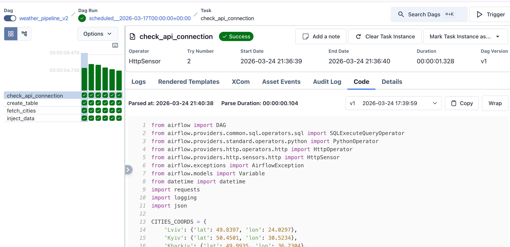
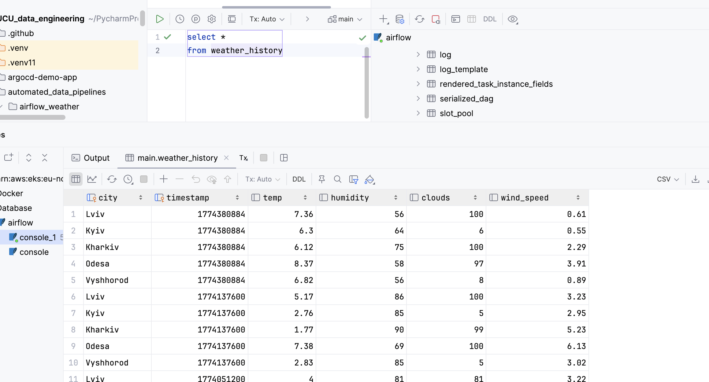

# Airflow Weather Pipeline

Automated weather data collection pipeline using Apache Airflow.

### 1. Build and run Airflow

```bash
docker-compose up --build
```

### 2. Open Airflow UI

Go to http://localhost:8085

Login credentials will be in simple_auth_magager_passwords.json

### 3. Set up Connections

In Airflow UI go to **Admin → Connections** and create:

**OpenWeatherMap API connection:**
- Connection Id: `openweather_api`
- Connection Type: `HTTP`
- Host: `https://api.openweathermap.org`

**SQLite connection:**
- Connection Id: `weather_conn`
- Connection Type: `SQLite`
- Host: `/opt/airflow/weather.db`

### 4. Set up Variables

In Airflow UI go to **Admin → Variables** and create:

- Key: `WEATHER_API_KEY`
- Value: your OpenWeatherMap API key (get it at https://openweathermap.org/api)

### 5. Enable the DAG

Find `weather_pipeline_v2` in the DAGs list and toggle it ON.

## Pipeline Overview

The DAG runs daily and performs:

1. **check_api_connection** - Verifies OpenWeatherMap API is available
2. **create_table** - Creates SQLite table if not exists
3. **fetch_cities** - Fetches weather data for all cities
4. **inject_data** - Stores data in SQLite database



## DAG Run Results




## Stop

```bash
docker-compose down
```